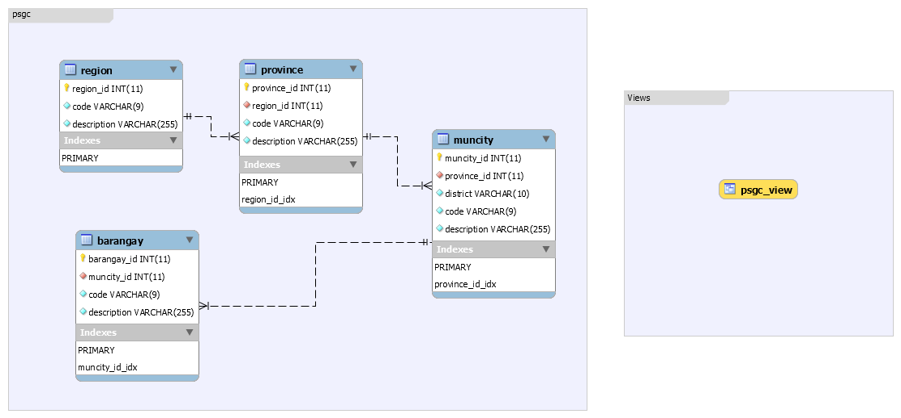

# Philippine Standard Geography Code (PSGC) - Data

Using the [data](http://www.nap.psa.gov.ph/csd/psgc1.asp) made public by the government, a mySQL, csv, and json file has been created which can be used by Developers who are in need of the Philippines Standard Geography Code (example of use case is for the Address).

The data currently contains:

1.  81 Province Records
2.  145 City Records
3.  1,489 Municipality Records
4.  42,036 Barangay Records

## What is PSGC?

[PSGC](http://www.nap.psa.gov.ph/csd/psgc1.asp) is a systemic way of classifying the geographic areas of the Philippines.

The PSGC database as of 31 December 2017 can be accessed at [PSGC Publication DEC2017](resources/PSGC-Publication-DEC2017.xlsx) in excel format. For more information please visit their website [here](http://nap.psa.gov.ph/activestats/psgc/).

The PSGC Classifies the geographical-political subdivisions of the country into 5 levels:

1.  Region
2.  Province
3.  City
4.  Municipality
5.  Barangay

## mySQL Information:

### Entity Relationship Diagram

The **schema** contains four tables:

1.  Region
2.  Province
3.  MunCity - a mixture of City and Municipality
4.  Barangay

The `code` column in the table stands for the **Philippine Standard Geographic Code**. While the `district` is the **[Legislative Districts](https://en.wikipedia.org/wiki/House_of_Representatives_of_the_Philippines#District_representation)**.



See the EERD File [here](resources/eerd.mwb).

### mySQL Installation

1.  Open the MySQL Workbench, and create a **schema**.

_Note: Replace the databaseName with your desired schema name_

```sql
    CREATE DATABASE  IF NOT EXISTS `databaseName`;
    USE `databaseName`;
```

2.  Execute the [table-region.sql](mysql/table-region.sql).
3.  Execute the [data-region.sql](mysql/data-region.sql).
4.  Execute the [table-province.sql](mysql/table-province.sql).
5.  Execute the [data-province.sql](mysql/data-province.sql).
6.  Execute the [table-muncity.sql](mysql/table-muncity.sql).
7.  Execute the [data-muncity.sql](mysql/data-muncity.sql).
8.  Execute the [table-barangay.sql](mysql/table-barangay.sql).
9.  Execute the [data-barangay.sql](mysql/data-barangay.sql).

### mySQL View

To see all the data within the Tables, check the [view-psgc.sql](mysql/view-psgc/sql).

```sql
CREATE OR REPLACE VIEW `psgc_view` AS
  SELECT b.`description` AS `barangay`,
         m.`description` AS `muncity`,
         m.`district` AS `district`,
         p.`description` AS `province`,
         r.`description` AS `region`
  FROM `barangay` b
  INNER JOIN `muncity` m
	ON m.`muncity_id` = b.`muncity_id`
  INNER JOIN `province` p
	ON p.`province_id` = m.`province_id`
  INNER JOIN `region` r
	ON r.`region_id` = p.`region_id`;
```

## JSON Format

[region.json](json/barangay.json)

```json
{
  "region_id": Number,
  "code": Number,
  "description": String
}
```

[province.json](json/province.json)

```json
{
  "province_id": Number,
  "region_id": Number,
  "code": Number,
  "description": String
}
```

[muncity.json](json/muncity.json)

```json
{
  "muncity_id": Number,
  "province_id": Number,
  "district": String,
  "code": Number,
  "description": String
}
```

[barangay.json](json/barangay,json)

```json
{
  "barangay_id": Number,
  "muncity_id": Number,
  "code": Number,
  "description": String
}
```

## CSV Format

The [psgc-data.xlsx](psgc-data.xlsx) is a compilation of the tables separated using sheets.

[region.csv](csv/region.csv)
`barangay_id, muncity_id, code, description`

[province.csv](csv/province.csv)
`province_id,region_id,code,description`

[muncity.csv](csv/muncity.csv)
`muncity_id,province_id,district,code,description`

[barangay.csv](csv/barangay.csv)
`barangay_id,muncity_id,code,description`

## License

PSGC-Data is [MIT Licensed](LICENSE.md).

## Acknowledgements

This repository is inspired by [clavearnel](https://github.com/clavearnel/philippines-region-province-citymun-brgy). The data used is from the [PSGC](http://nap.psa.gov.ph/activestats/psgc/).
